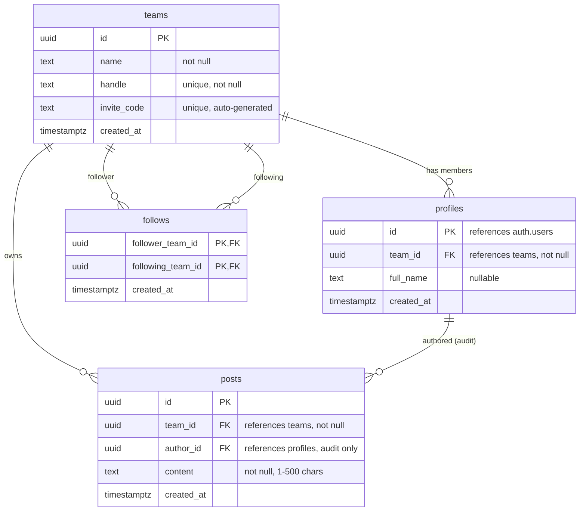
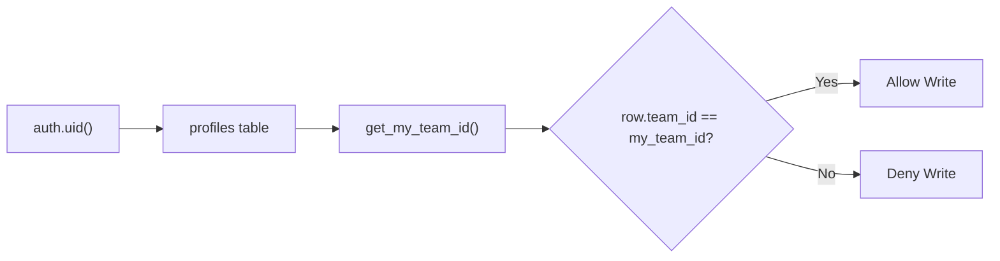
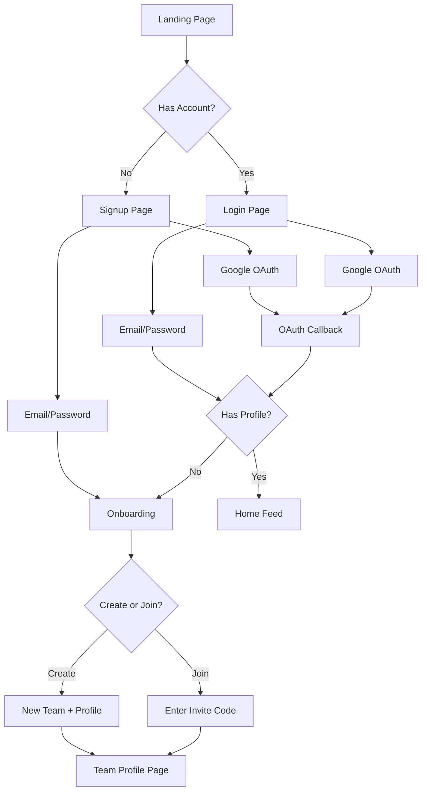

# TeamPost — Team-Based Social Media MVP

A team-based social media web application built with **Next.js 15 (App Router)** and **Supabase**. All content is created and displayed under team identities — there are no individual profiles.

## Live Demo

**[https://app-tawny-psi.vercel.app](https://app-tawny-psi.vercel.app)**

## Repository

**[https://github.com/YurdakosKaan/teampost-mvp](https://github.com/YurdakosKaan/teampost-mvp)**

---

## Getting Started

### Prerequisites

- Node.js 18+
- A [Supabase](https://supabase.com) project

### 1. Clone & Install

```bash
git clone https://github.com/YurdakosKaan/teampost-mvp.git
cd teampost-mvp
npm install
```

### 2. Set up Supabase

1. Create a new project at [supabase.com](https://supabase.com)
2. Run the migration in `supabase/migrations/001_schema.sql` via the Supabase SQL Editor
3. In **Authentication > Sign In / Providers > Email**, optionally disable "Confirm email" for easier testing
4. (Optional) Enable Google OAuth in **Authentication > Providers > Google** with your OAuth client credentials
5. In **Authentication > URL Configuration**, set the Site URL and add redirect URLs for your deployment

### 3. Environment Variables

Copy the example env file and fill in your Supabase credentials:

```bash
cp .env.local.example .env.local
```

```env
NEXT_PUBLIC_SUPABASE_URL=https://your-project.supabase.co
NEXT_PUBLIC_SUPABASE_ANON_KEY=your-anon-key
```

### 4. Run

```bash
npm run dev
```

Open [http://localhost:3000](http://localhost:3000).

---

## Supabase Schema

### Tables

| Table | Purpose |
|-------|---------|
| `teams` | Team entities with name, URL handle, and invite code |
| `profiles` | Links `auth.users` to exactly one team |
| `posts` | Text content (max 500 chars) owned by teams |
| `follows` | Directional team-to-team follow relationships |

### Entity Relationship Diagram



### Key Constraints

- `profiles.id` references `auth.users` (1:1)
- `profiles.team_id` references `teams` (many users can share a team)
- `posts.team_id` references `teams` (ownership)
- `posts.author_id` references `profiles` (audit trail only — not displayed in UI)
- `follows` has composite PK `(follower_team_id, following_team_id)`
- `follows` has a CHECK constraint preventing self-follows
- `teams.handle` uses a regex CHECK for URL-safe slugs (`^[a-z0-9_-]+$`)
- `teams.invite_code` is unique and auto-generated (8-char hex)

### Row Level Security (RLS)

All tables have RLS enabled. The core pattern uses a `get_my_team_id()` helper function to resolve the current user's team:

| Table | SELECT | INSERT | DELETE |
|-------|--------|--------|--------|
| teams | Everyone | Authenticated users | — |
| profiles | Everyone | Own user only (`id = auth.uid()`) | — |
| posts | Everyone (public feed) | Own team members only | Own team members only |
| follows | Everyone | Own team as follower | Own team as follower |

**Core RLS pattern:**



The public SELECT on all tables enables the public global feed (no auth required to read) while ensuring all write operations are scoped to the authenticated user's team. The `security definer` helper function avoids infinite RLS recursion when checking team membership.

### Database Functions

- **`create_team_and_profile(_user_id, _team_name, _team_handle, _full_name)`** — Atomically creates a team (with auto-generated invite code) and the user's profile in one transaction
- **`join_team(_user_id, _team_id, _invite_code, _full_name)`** — Validates the invite code and adds the user's profile to an existing team
- **`get_my_team_id()`** — Helper used by RLS policies to resolve the current user's team

All functions are `security definer` to bypass RLS during onboarding (where the profile doesn't yet exist).

---

## Architecture & Key Decisions

### Why build from scratch (not MakerKit)

The MakerKit starter includes billing, subscriptions, and org management — heavy SaaS boilerplate irrelevant to this case. A clean setup keeps the code focused and demonstrates architectural understanding without noise.

### Auth Flow

Both email/password and Google OAuth follow the same unified flow:



1. **Sign up** — creates the auth user only (no team yet)
2. **Onboarding** — user creates a new team OR joins an existing team via invite code
3. **Redirect** — user lands on their team's profile page with full navbar

- **Session persistence** is handled by `@supabase/ssr` with cookie-based sessions and Next.js middleware that refreshes the session on every request.
- **Team membership enforcement** — the middleware checks every request: if a logged-in user has no profile, they are redirected to onboarding regardless of which page they try to visit.
- **OAuth callback** at `/auth/callback` checks for existing profile and routes accordingly.

### Team Model & Invite System

- Every user belongs to exactly one team — enforced at DB level (profiles PK) and middleware level
- Logged-in users without a team are locked to `/onboarding` — they cannot browse the app until they create or join a team
- Teams have an auto-generated 8-character invite code
- Joining a team requires the correct invite code (validated both client-side and in the DB function)
- Team members can see, copy, and **regenerate** the invite code from the team profile page
- Regenerating invalidates the old code immediately — security mitigation if a code leaks
- Three layers of defense against duplicate profiles: DB constraint, middleware guard, server action check

### Posting

- Posts are team-owned — RLS enforces that `team_id` matches the poster's team
- Content is limited to 500 characters (enforced at DB level and in the UI)
- The compose page is auth-protected via middleware
- `author_id` is stored for audit purposes but never shown in the UI — all posts display as the team

### Follow System

- Follows are team-to-team, one-directional
- A CHECK constraint prevents self-follows at the DB level
- The follow button uses optimistic UI with server action validation

### Feed

- The home feed is a global feed showing all posts, newest first
- No authentication required to view (public read via RLS)
- Server-rendered with `revalidate = 0` for fresh data on every request

### Edge Cases Handled

- **Team membership enforcement** — users without a team are locked to onboarding via middleware
- **Duplicate profile prevention** — three layers: DB primary key, middleware redirect, server action check
- **Stale navbar** — revalidatePath on every auth state change forces fresh server component renders
- **OAuth users without profiles** — redirected to onboarding after callback
- **Invite code leaks** — team members can regenerate codes with confirmation dialog
- **Friendly errors** — raw DB constraint violations translated to user-friendly messages

---

## Project Structure

```
src/
  app/
    page.tsx                    # Home feed (public, SSR)
    layout.tsx                  # Root layout with navbar
    login/page.tsx              # Email/password + Google OAuth login
    signup/page.tsx             # Account creation (email/password)
    onboarding/page.tsx         # Team create (with handle) or join (with invite code)
    compose/page.tsx            # Create a new post
    auth/callback/route.ts      # OAuth callback handler
    team/[handle]/page.tsx      # Team profile page
    actions/
      auth.ts                   # Auth + team onboarding server actions
      posts.ts                  # Post creation server action
      follows.ts                # Follow/unfollow server actions
      teams.ts                  # Invite code regeneration server action
  components/
    navbar.tsx                  # Top nav with auth state (server component)
    post-card.tsx               # Single post display
    follow-button.tsx           # Follow/unfollow toggle
    invite-code.tsx             # Invite code display, copy, and regenerate
    ui/                         # shadcn/ui primitives (incl. AlertDialog)
  lib/
    supabase/
      client.ts                 # Browser Supabase client
      server.ts                 # Server Supabase client (cookies)
      middleware.ts             # Session refresh + route guards
    types.ts                    # TypeScript interfaces
    utils.ts                    # cn() utility
  middleware.ts                 # Next.js middleware entry point
supabase/
  migrations/
    001_schema.sql              # Full schema, RLS, functions
```

---

## What I Would Improve With More Time

1. **"Following" feed** — Show posts only from teams you follow, as a tab alongside the global feed
2. **Cursor-based pagination** — The current `LIMIT 50` is fine for MVP but doesn't scale. Keyset pagination on `(created_at, id)` would be the next step
3. **Real-time updates** — Supabase Realtime could push new posts to the feed without polling
4. **Role management** — Team admin vs. member roles (intentionally out of scope per case instructions)
5. **Post deletion UI** — RLS already supports team members deleting posts, but the UI doesn't expose it yet
6. **Avatar uploads** — Supabase Storage for team avatars instead of initial-based fallbacks
7. **Email confirmation** — Supabase supports it natively; disabled for faster MVP testing and evaluator access
8. **Rate limiting** — Server-side rate limiting on post creation and follow actions
9. **Tests** — Integration tests for server actions and RLS policies using Supabase's test helpers
10. **Invite link expiry** — Time-limited or single-use invite codes for production use

---

## Tech Stack

- [Next.js 15](https://nextjs.org/) — App Router, Server Components, Server Actions
- [Supabase](https://supabase.com/) — Auth, PostgreSQL, Row Level Security
- [Tailwind CSS v4](https://tailwindcss.com/) — Styling
- [shadcn/ui](https://ui.shadcn.com/) — UI component primitives
- TypeScript — End-to-end type safety
- Vercel — Production deployment with GitHub integration
